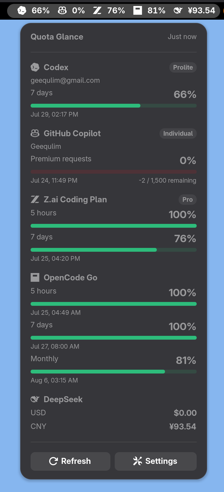

# Quota Glance

[English](README.md) | [简体中文](README.zh-CN.md)

Quota Glance is a GNOME Shell extension that shows service quotas and balances
in a GNOME panel.

The project currently targets GNOME Shell 50. The W0–W4 foundation uses
TypeScript 7, Oxlint, GJS, and LibSoup 3. It includes the state and refresh
runtime, dynamic panel/popup UI, environment loading, sanitized HTTP errors,
and real Codex, GitHub Copilot, DeepSeek, Z.ai, and OpenCode Go providers.

<p align="center">
  
</p>

## Provider configuration

Codex uses the installed, signed-in `codex` CLI. GitHub Copilot uses the
installed, signed-in `gh` CLI. Quota Glance never reads or implements their
authentication tokens itself.

The HTTP providers read these variables:

```text
DEEPSEEK_API_KEY
Z_AI_API_KEY
OPENCODE_GO_WORKSPACE_ID
OPENCODE_GO_AUTH_COOKIE
```

Values are loaded with this precedence:

```text
~/.config/quota-glance/env
current GNOME session environment
~/.config/environment.d/*.conf
/etc/environment
```

Environment files accept only literal `KEY=VALUE` assignments. They do not
execute commands or expand shell variables. API keys, authorization headers,
cookies, and tokens are removed from user-facing HTTP errors.

Provider switches and the automatic refresh interval live in the extension's
settings window. Open it from the popup's **Settings** item, from the Extensions
app, or with:

```sh
gnome-extensions prefs quota-glance@geequlim
```

Quota Glance uses GNOME's top panel by default. When a bottom Dash to Panel
panel is actually available, the settings window adds a **Panel position**
choice that can move Quota Glance between the GNOME top panel and the Dash to
Panel bottom panel. The choice is hidden when no bottom panel exists, and the
indicator safely falls back to the GNOME panel. The same setting can be changed
from the command line:

```sh
gsettings set org.gnome.shell.extensions.quota-glance panel-target main
gsettings set org.gnome.shell.extensions.quota-glance panel-target dash-to-panel
```

## Development

```sh
npm install
npm run dev
npm run typecheck
npm run lint
npm test
npm run test:providers:live
npm run test:providers:cli:live
npm run test:gnome
npm run test:gnome:dtp
npm run package
```

`npm run dev` is the normal visual development loop. It builds and packages the
extension, starts a visible nested GNOME Shell 50 session, and opens its popup
automatically. When Dash to Panel is installed system-wide, the preview also
loads it and selects its bottom panel. The development
preview enables all providers and uses an isolated temporary keyfile
backend. Close the nested GNOME window to stop it. The settings are shared with
the preview's Preferences window, then removed on exit. The host desktop
session, settings, and installed extensions are not modified. The preview
passes the host `GH_CONFIG_DIR` through to `gh`, so Copilot uses the existing
GitHub CLI login without copying credentials into the temporary profile.

GNOME 49 and newer require Mutter DevKit for visible nested sessions. Install
it once on CachyOS/Arch:

```sh
sudo pacman -S --needed mutter-devkit
```

The extension bundle is written to `artifacts/`. For host-machine testing, use
these two commands:

```sh
npm run host:install
npm run host:clean
```

`host:install` builds, packages, replaces any existing local copy, and enables
the extension. `host:clean` disables and removes only the current user's
`quota-glance@geequlim` installation. It preserves extension settings and
provider credentials. The older `npm run install:local` name remains as an
alias for `host:install`. On the first host installation, GNOME Shell's Wayland
session may not discover the new local UUID until the next login. In that case
the command still completes successfully and prints the one-time login notice;
the files are already installed and the command does not need to be rerun.

GNOME Shell caches its extension registry for the lifetime of a Wayland
session. When installing the extension for the first time, sign out and back in
before enabling it. Development changes can be verified without logging out by
running `npm run test:gnome`, which starts an isolated headless GNOME Shell 50
session and exercises the popup, independent provider toggles, partial refresh
failure, and five enable/disable cycles.

## Release

Release operations use the Tiny shortcuts in `project.tiny` rather than npm
scripts:

```sh
tiny run publish/version
tiny run publish/build
tiny run publish/github
tiny run publish/aur
```

`publish/version` prints the current version, prompts for a new
`MAJOR.MINOR.PATCH` version in the terminal, updates `package.json`,
`package-lock.json`, and `metadata.json`, then prints the Git commit, tag, and
push commands to run.

`publish/build` runs the complete release checks and writes the GNOME
Extensions submission ZIP to `artifacts/`.

After the new commit and its `vMAJOR.MINOR.PATCH` tag have both been pushed,
`publish/github` runs the complete release checks, builds the extension ZIP,
generates `SHA256SUMS`, and publishes both assets in a GitHub Release.

`publish/aur` requires an existing GitHub Release for the current version. It
downloads the extension ZIP from that release, calculates its checksum,
generates `PKGBUILD` and `.SRCINFO`, commits them, and pushes the
`gnome-shell-extension-quota-glance` AUR repository. The repository is cached
under `~/.cache/quota-glance/aur/` by default; set `AUR_REPO_DIR` to use an
existing checkout. Publishing requires an AUR account with SSH access and the
Arch `makepkg` command.

## License

Copyright © 2026 Geequlim.

Quota Glance is distributed under the
[GNU General Public License v3.0 or later](LICENSE).

See [GNOME_TYPESCRIPT_PROJECT_PLAN.md](docs/GNOME_TYPESCRIPT_PROJECT_PLAN.md) for the
architecture and implementation roadmap.
