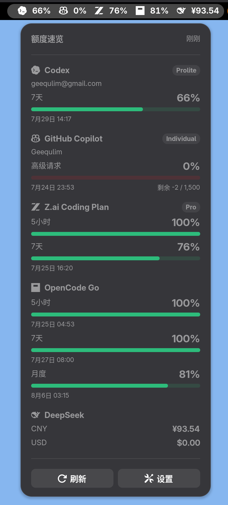

# Quota Glance

[English](README.md) | [简体中文](README.zh-CN.md)

Quota Glance 是一个 GNOME Shell 扩展，用于在 GNOME 面板中快速查看各项服务的额度和余额。

项目目前面向 GNOME Shell 50，使用 TypeScript 7、Oxlint、GJS 和 LibSoup 3
构建。它包含状态与定时刷新运行时、动态面板及弹出层界面、环境变量加载、HTTP
错误脱敏，以及真实的 Codex、GitHub Copilot、DeepSeek、Z.ai 和 OpenCode Go
Provider。

<p align="center">
  
</p>

## Provider 配置

Codex 使用本机已安装并登录的 `codex` CLI。GitHub Copilot 使用本机已安装并登录的
`gh` CLI。Quota Glance 不会自行读取或实现这两个工具的身份验证令牌。

HTTP Provider 使用以下环境变量：

```text
DEEPSEEK_API_KEY
Z_AI_API_KEY
OPENCODE_GO_WORKSPACE_ID
OPENCODE_GO_AUTH_COOKIE
```

配置值按照以下优先级加载：

```text
~/.config/quota-glance/env
当前 GNOME 会话环境变量
~/.config/environment.d/*.conf
/etc/environment
```

环境配置文件只接受字面量形式的 `KEY=VALUE`，不会执行命令，也不会展开 Shell
变量。面向用户显示 HTTP 错误时，API Key、Authorization Header、Cookie 和 Token
都会被移除。

Provider 开关和自动刷新间隔位于扩展设置窗口中。可以通过弹出层中的
**设置**、GNOME 扩展应用或以下命令打开：

```sh
gnome-extensions prefs quota-glance@geequlim
```

Quota Glance 默认显示在 GNOME 顶部面板。当系统中确实存在 Dash to Panel
底部面板时，设置窗口会显示**面板位置**选项，允许在 GNOME 顶部面板和 Dash to
Panel 底部面板之间切换。没有可用的底部面板时，该选项会隐藏，指示器也会安全回退到
GNOME 顶部面板。还可以通过命令行修改相同的设置：

```sh
gsettings set org.gnome.shell.extensions.quota-glance panel-target main
gsettings set org.gnome.shell.extensions.quota-glance panel-target dash-to-panel
```

## 开发

```sh
npm install
npm run dev
npm run typecheck
npm run lint
npm test
npm run test:providers:live
npm run test:providers:cli:live
npm run test:gnome
npm run test:gnome:dtp
npm run package
```

`npm run dev` 是常用的可视化开发流程。它会构建并打包扩展，启动一个可见的嵌套
GNOME Shell 50 会话，并自动打开弹出层。如果系统已安装 Dash to Panel，预览环境也会
加载它并选择其底部面板。

开发预览会启用所有 Provider，并使用隔离的临时 keyfile 后端。关闭嵌套 GNOME
窗口即可停止预览。设置会与预览环境中的首选项窗口共享，并在退出时删除；宿主桌面
会话、设置和已安装扩展不会被修改。预览环境会把宿主的 `GH_CONFIG_DIR` 传递给
`gh`，因此 Copilot 可以使用已有的 GitHub CLI 登录状态，不需要把凭据复制到临时
配置中。

GNOME 49 及以上版本需要 Mutter DevKit 才能运行可见的嵌套会话。在
CachyOS/Arch 上只需安装一次：

```sh
sudo pacman -S --needed mutter-devkit
```

扩展安装包会写入 `artifacts/`。在宿主机上测试时使用：

```sh
npm run host:install
npm run host:clean
```

`host:install` 会构建、打包、替换已有的本地安装并启用扩展。`host:clean`
只会禁用并删除当前用户安装的 `quota-glance@geequlim`，不会清除扩展设置和
Provider 凭据。旧的 `npm run install:local` 仍作为 `host:install` 的别名保留。

第一次安装时，当前运行的 GNOME Shell Wayland 会话可能还无法发现新 UUID。此时命令
仍会成功完成，并提示只需重新登录一次；扩展文件已经安装，无需重新执行安装命令。

GNOME Shell 会在整个 Wayland 会话生命周期内缓存扩展注册表。开发过程中可以使用
`npm run test:gnome` 验证修改，无需注销。该命令会启动隔离的无头 GNOME Shell 50
会话，测试弹出层、独立 Provider 开关、部分刷新失败，以及连续五次启用和禁用。

## 发布

发布操作使用 `project.tiny` 中的 Tiny 快捷指令，不通过 npm scripts：

```sh
tiny run publish/version
tiny run publish/build
tiny run publish/github
tiny run publish/aur
```

`publish/version` 会显示当前版本，并在终端中等待输入新的
`MAJOR.MINOR.PATCH` 版本号。随后它会更新 `package.json`、`package-lock.json` 和
`metadata.json`，并打印 Git 提交、创建标签和推送标签所需的命令。

`publish/build` 会执行完整的发布前检查，并将可提交到 GNOME Extensions 的 ZIP
写入 `artifacts/`。

新提交及其 `vMAJOR.MINOR.PATCH` 标签都推送完成后，`publish/github`
会再次执行完整发布检查、构建扩展 ZIP、生成 `SHA256SUMS`，然后将两个文件发布到
GitHub Release。

`publish/aur` 要求当前版本已经存在对应的 GitHub Release。它会从 Release 下载扩展
ZIP、计算校验值、生成 `PKGBUILD` 和 `.SRCINFO`，然后提交并推送
`gnome-shell-extension-quota-glance` AUR 仓库。

AUR 仓库默认缓存在 `~/.cache/quota-glance/aur/`；也可以通过
`AUR_REPO_DIR` 指定已有的本地仓库。发布前需要准备好具有 SSH 权限的 AUR 账号，并
安装 Arch 的 `makepkg`。

## 许可证

Copyright © 2026 Geequlim.

Quota Glance 使用
[GNU General Public License v3.0 or later](LICENSE)
发布。

架构和实现路线参见
[GNOME_TYPESCRIPT_PROJECT_PLAN.md](docs/GNOME_TYPESCRIPT_PROJECT_PLAN.md)。
